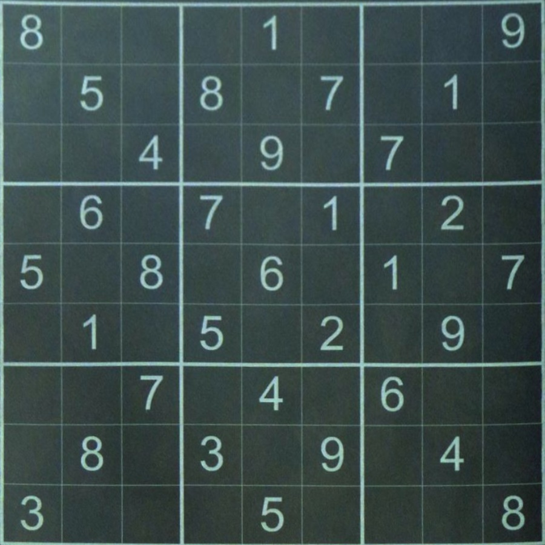

# sudoku_solver
This is a home project that solves the famous number-placement puzzle - [SUDOKU](https://en.wikipedia.org/wiki/Sudoku),
combined with OpenCV and PyTorch libraries.

It is an end-to-end pipeline that works as the figure below shows.

<p align="center"></p>

a. full RGB image input

b. processes the viewing perspective.

c. DL model recognizes the digit in the grid

d. numbers are identified

e. puzzle is solved


## Table of Contents
1. Image preprocessing
2. Digits recognition
3. Sudoku solver

### Image Preprocessing

Here is an sample input image that contains a full Sudoku puzzle:
<p align="center"></p>

The processed image will look like this:
<p align="center"></p>


### Digit Recognition

This part of the pipeline uses Deep Learning models for the task of
digit recognition.

Please download pre-trained weights from [Google Drive](https://drive.google.com/file/d/1J1BXEoWk35DduHypjVp1W4GCUn2yPvIS/view?usp=sharing) that achieves up to 99% of accuracy on MNIST dataset.
The model can be found at `utils/model.py`.

If instead you want to train your own model from scratch, run
```
python3 train.py --save_model
```
This will automatically download the MNIST dataset in backend and start training on model.
It should take less than 10 minutes to train for 10 epochs on Macbook M1 chip.

### Sudoku Solver
Input of the puzzle
```
8 2 7 | 5 6 4 | 0 0 0 
0 0 0 | 0 1 0 | 5 0 0 
0 0 1 | 8 0 3 | 0 0 0 
---------------------
3 0 0 | 0 4 0 | 9 1 0 
7 0 0 | 2 0 0 | 0 0 8 
0 9 0 | 0 0 1 | 0 6 0 
---------------------
0 0 0 | 4 0 0 | 0 0 2 
0 7 0 | 0 3 0 | 0 0 0 
4 0 9 | 0 0 0 | 0 0 0 
```

`sudoku` is a boolean function that returns whether the given puzzle has been solved.

Arguments (puzzle, 0, 0) mean that the code will start solving the puzzle from 0th row and 0th column.

To solve the puzzle, use the following code:
```
if sudoku(puzzle, 0, 0):
    visualize(puzzle)
```

If there is a unique solution to the input puzzle,
it will return 
```
8 2 7 | 5 6 4 | 1 3 9 
9 4 3 | 7 1 2 | 5 8 6 
6 5 1 | 8 9 3 | 7 2 4 
---------------------
3 8 2 | 6 4 7 | 9 1 5 
7 1 6 | 2 5 9 | 3 4 8 
5 9 4 | 3 8 1 | 2 6 7 
---------------------
1 3 5 | 4 7 8 | 6 9 2 
2 7 8 | 9 3 6 | 4 5 1 
4 6 9 | 1 2 5 | 8 7 3 
```


### TODO
- [X] Use OpenCV to preprocess images
- [X] Use PyTorch to build a DNN that recognizes digits
- [ ] Process the recognized numbers by placing them correctly on the grid
- [X] Solve sudoku